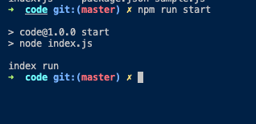

# Node.js
Node.js가 등장하기 전에는 Javascript를 실행할 수 있는 엔진을 가진 도구는 웹 브라우저 밖에 없었다.

그래서 Javascript를 실행할 수 있는 엔진을 탑재한 웹 브라우저를 `자바스크립트 런타임`이라고 불렀다.

`Node.js는 자바스크립트를 실행할 수 있는 또다른 엔진이다.` 그래서 Node.js도 자바스크립트 런타임이라 부를수 있다.

Node.js 덕분에 Javascript의 실행 환경이 웹에 한정되지 않게 되었다.

Node.js의 짝수 버전이 LTS이다. (최소 3년간 지원해줌)

Node.js를 설치하면 npm이라는 도구도 함께 설치되는데, Node.js기반으로 만들어진 패키지를 관리해주는 도구이다. 

단순한 js 파일 하나 실행하려면 `node 파일명.js` 하면됨.

# Node.js 패키지 만들기
`npm init`을 실행하면 기본 프로젝트를 하나 만들수 있음.

package.json 파일이 생성되는데 script를 작성하면 복잡한 명령어를 한번에 실행할 수 있다.

# Node.js 모듈 시스템

Javascript에서는 독릭된 하나의 파일을 `모듈`이라 부름. 자바로 치면 특정 목적을 가진 클래스 정도나 좀 크게보면 패키지 정도로 볼수 있을듯.

모듈은 독립적이고 재사용이 가능해야한다.

`ES 모듈 시스템`은 `ECMAScript 모듈 시스템`의 약자임. 리액트, Vue와 같은 프론트엔드 기술은 대부분 ES를 적용함.

그러나 Node.js는 `CommonJS(CJS)`를 사용함. 따라서 ES를 사용하려면 package.json에서 `"type": "module"`를 추가하면 된다.

# 모듈 내보내기, 불러오기

`circle.js`, `index.js` 코드 참고